#  **Amazon Sales Dataset – Exploratory Sales Analysis**

In this project, I explore the Amazon Sales dataset and examine how product categories, pricing, discounts, and customer ratings interact.
The goal is to practice data cleaning, visualization, NLP, and derive insights from real-world e-commerce data.

All code is in **`amazon.ipynb`**.

---

## Project Structure

```text
amazon-sales-analysis/
│
├── README.md
│
├── Amazon.ipynb
│
├── data/
│   └── amazon.csv
│
└── images/
    ├── price_vs_rating_colored.png
    ├── category_bubble_chart.png
    ├── category_share_donut.png
    ├── correlation_heatmap.png
    ├── discount_by_rating_bucket.png
    ├── discount_distribution_by_category.png
    ├── discount_percentage_rating.png
    ├── high_low_rating_product.png
    ├── pairplot_features.png
    ├── price_rating_count.png
    ├── rating_distribution_name.png
    ├── top_ten_by_product.png
    ├── top_ten_most_reviewed.png
    ├── word_cloud_of_amazon.png

\## Dataset Overview
The dataset includes thousands of Amazon products and contains:

\- Product name

\- Product category

\- Actual price

\- Discounted price

\- Discount percentage

\- Rating

\- Rating count

\- Customer reviews

I focused on understanding how pricing strategies, category types, product quality, and customer engagement relate to each other.

\## Key Questions

1\- What does the overall rating distribution look like?

2\- Which product categories dominate the dataset?

3\- Which categories receive the highest number of customer reviews?

4\- How do discounts vary across rating buckets and categories?

5\- What correlations exist between price, discounts, ratings, and review counts?

6\- What do customers commonly talk about in their reviews (NLP)?


\## Data Preparation Summary

\- Loaded dataset from data/amazon_sales_dataset.csv

\- Converted price fields to numeric format

\- Removed duplicates based on product ID

\- Created rating buckets for comparison

\- Engineered additional fields such as:

discount_amount

is_high_rating

log_rating_count

\- Cleaned review text using NLTK for NLP visualizations

\- All details are in the notebook


\## Visual Analysis


---


\### \*\*Rating Distribution\*\*

Purpose:
  - Understand overall customer sentiment.
  - Check if ratings are skewed toward positive or negative values.

Insights:
  - Ratings cluster heavily around 4.0–4.5.
  - Very few low-rated products.
  - Indicates generally satisfied customers and typical Amazon rating inflation.

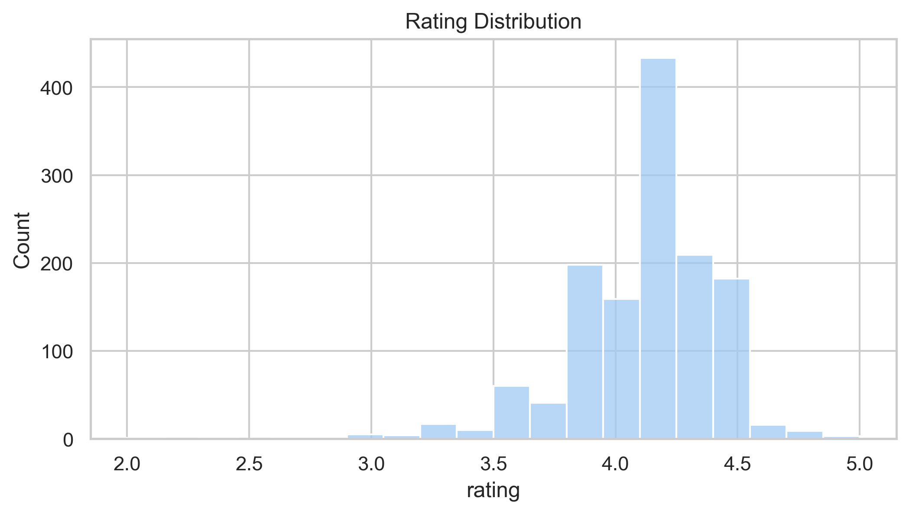


\### \*\*Top 10 Categories by Product Count\*\*
Purpose:
  - Identify the categories with the highest number of products.
  - Understand supply-side concentration.

Insights:
  - Accessory categories such as cables and chargers appear most frequently.
  - Electronics occupy a significant part of the product catalog.

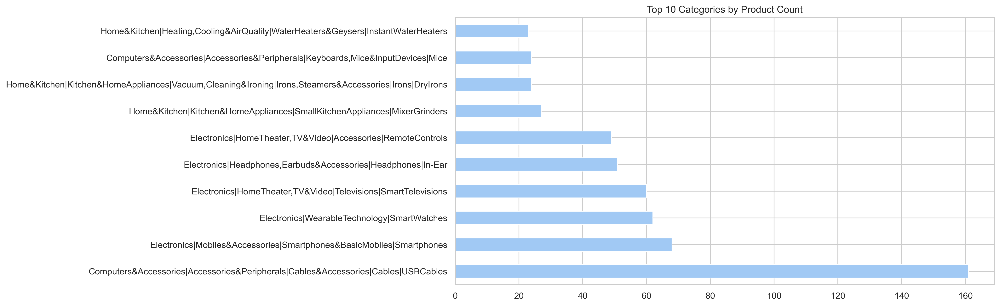


\### \*\*Top 10 Most Reviewed Categories\*\*
Purpose:
  - Measure popularity based on total review count.
  - Identify categories with the highest customer interaction.

Insights:
  - Some categories with fewer products attract significantly more reviews.
  - Electronics categories show consistently high engagement.

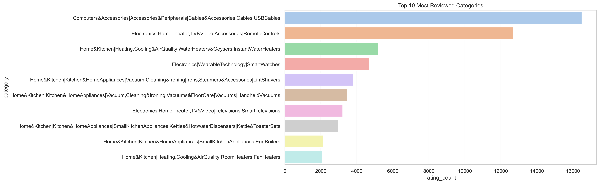


\### \*\*Correlation Heatmap\*\*
Variables analyzed:
  - actual_price
  - discounted_price
  - discount_percentage
  - rating
  - rating_count

Key Findings:
  - Strong positive correlation between actual_price and discounted_price.
  - Weak relationships between price/discount and rating.
  - rating_count sometimes increases with actual_price.


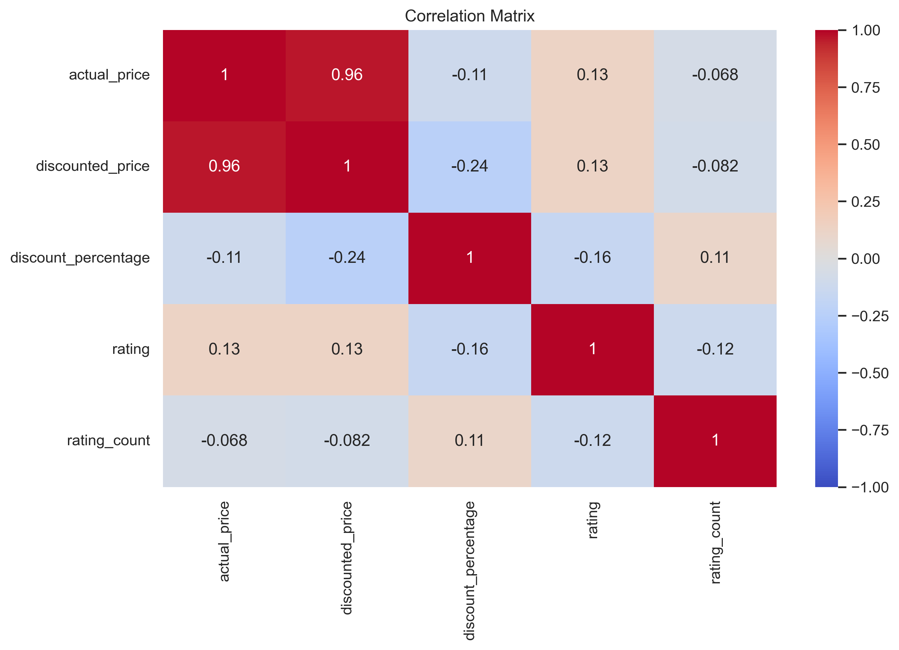

\### \*\*Price vs Rating (Colored by Discount %)\*\*
Purpose:
  - Explore how price relates to rating.
  - Observe if discount percentage affects rating patterns.

Insights:
  - Ratings remain high across all price levels.
  - Discounts exist across both cheap and expensive items.
  - No strong relationship between discount size and rating.


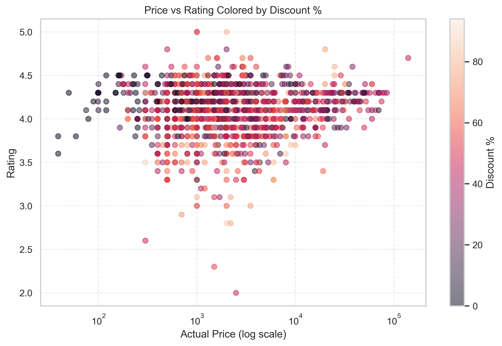

\### \*\*Category Performance Bubble Chart\*\*
Metrics calculated per category:
  - Average discount percentage
  - Average rating
  - Total rating count (bubble size)

Insights:
  - Highlights categories with high discounts or strong ratings.
  - Shows which product types receive the most customer engagement.

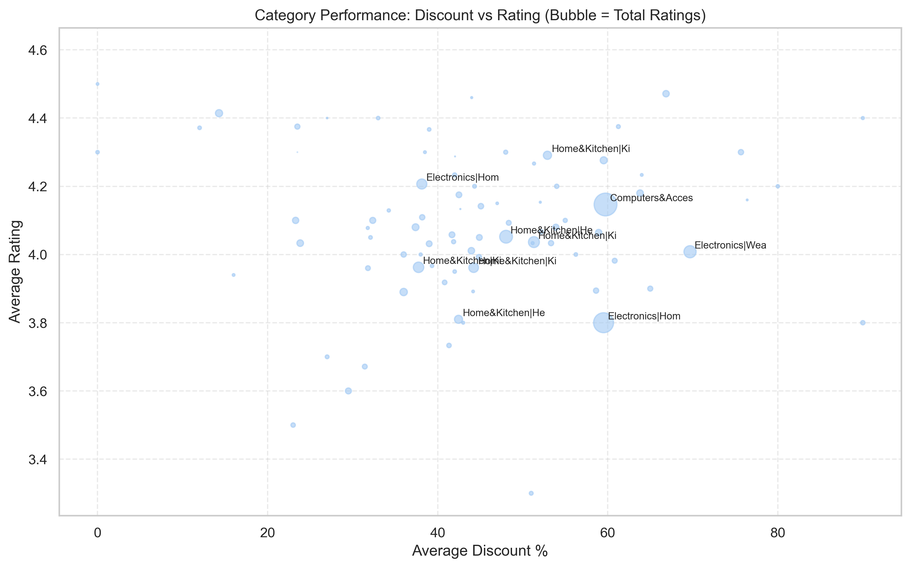

\### \*\*Category Share Donut Chart\*\*
Purpose:
  - Show proportional representation of major product categories.

Insights:
  - Accessory items and everyday-use categories hold a large share.


\### \*\*Discount % by Rating Bucket\*\*
Purpose:
  - Compare discount levels across different rating groups.

Insights:
  - Some lower-rated products receive higher discount levels.
  - Discounts may be used to boost sales of underperforming products.

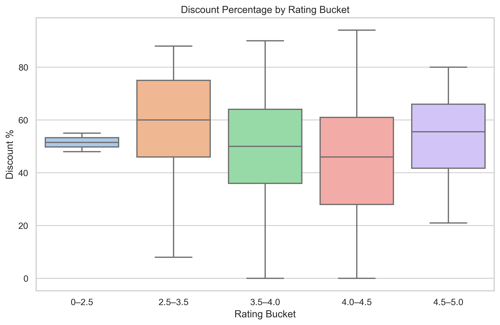

\### \*\*Discount % Distribution for Top Categories\*\*
Purpose:
  - Understand how discount approaches vary between product types.

Insights:
  - Commodity categories often show higher discount variation.
  - Premium or high-tech categories tend to maintain smaller discounts.


\### \*\*Discount Percentage vs Rating\*\*
Purpose:
  - Examine whether discount percentage influences product rating.

Insights:
  - No clear correlation is visible.
  - Products with high discounts can still have poor ratings and vice versa.


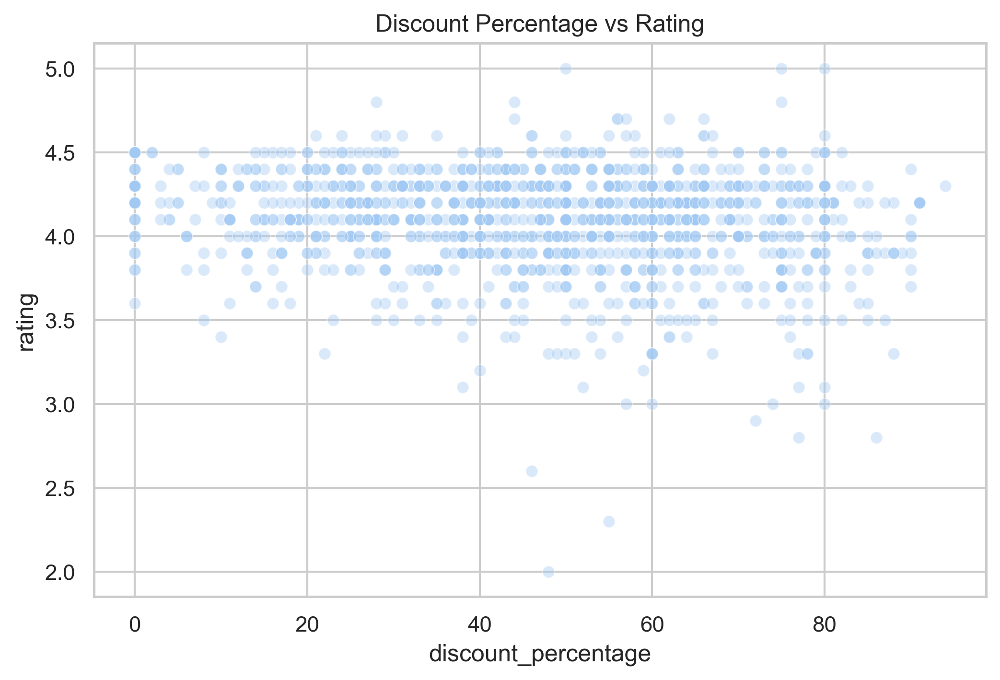

\### \*\*High vs Low Rated Product Discounts\*\*
Groups:
  - High-rated: rating >= 4.0
  - Low-rated: rating < 4.0

Insights:
  - Low-rated products often show higher discount ranges.
  - High-rated items typically rely less on steep discounting.

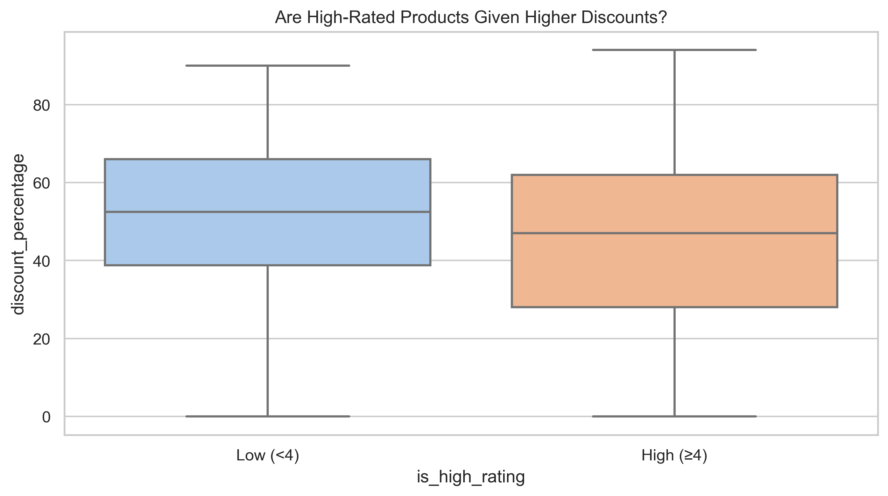

\### \*\*Pairplot of Key Numerical Features\*\*
Variables visualized:
  - actual_price
  - discounted_price
  - discount_percentage
  - rating
  - rating_count

Insights:
  - Price variables show strong linearity.
  - rating_count shows heavy skew.
  - No strong visual relationship between discount and rating.

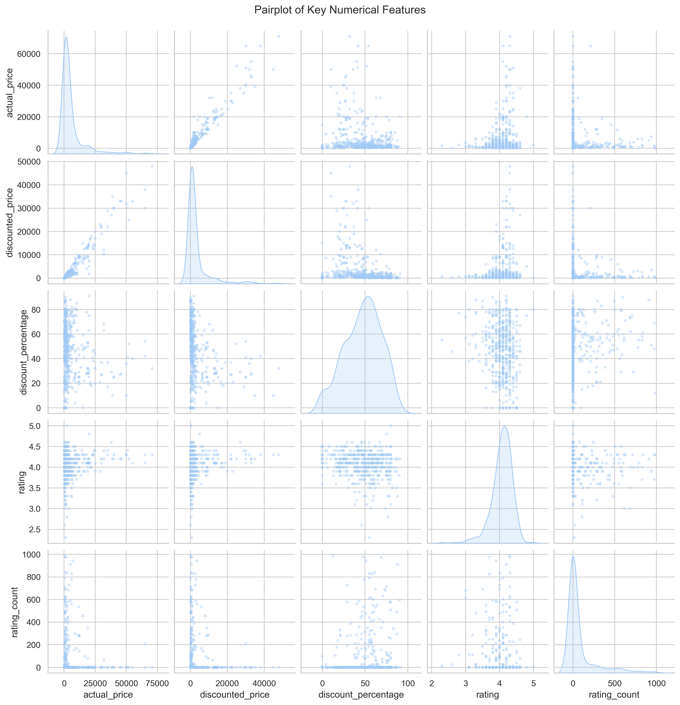


\### \*\*Price vs Rating Count (Log Scale)\*\*
Purpose:
  - Explore how product price relates to review volume.
  - Use log-scale to normalize skewed review counts.

Insights:
  - Both cheap and expensive items can receive many reviews.
  - High engagement occurs for different reasons (value vs. demand).

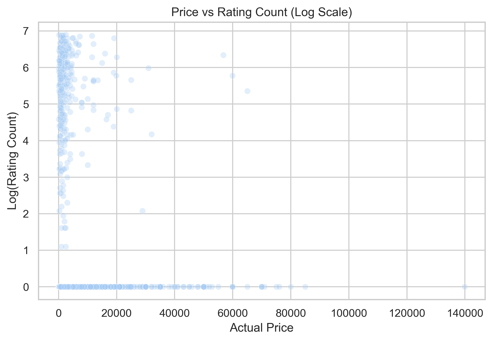

\### \*\*Word Cloud of Customer Reviews\*\*
Steps:
  - Clean review text
  - Remove stopwords
  - Generate word frequency visualization

Insights:
  - Frequent words include “good”, “product”, “quality”, “use”, “phone”, “cable”.
  - Indicates customers focus heavily on usability and product quality.

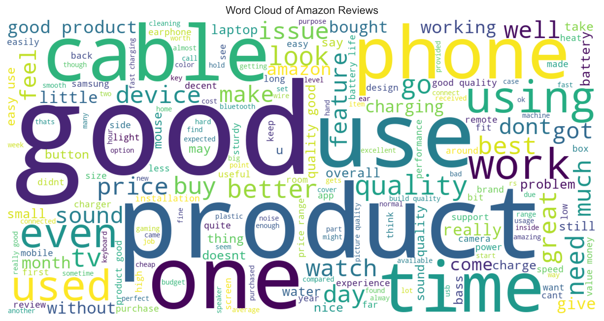

Run the script:


```bash

python src/amazon_analysis.py

```


\# \*\*Author\*\*

Emre Aksu

GitHub: https://github.com/emreaksua/

LinkedIn: https://www.linkedin.com/in/emreaksuecon/


